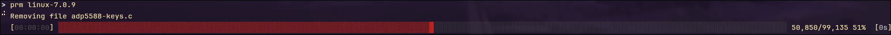

# prm



## Syntax

```bash
prm <PATH> [-v]
```
It will work on both files and directories, with progress bar obviously being only visible on the latter. `-v` will print out every deleted file much like `rm -v`.

## Installation

```bash
cargo install --git https://github.com/Commensalism1997/prm # Provided you have cargo and have .cargo/bin in $PATH
```